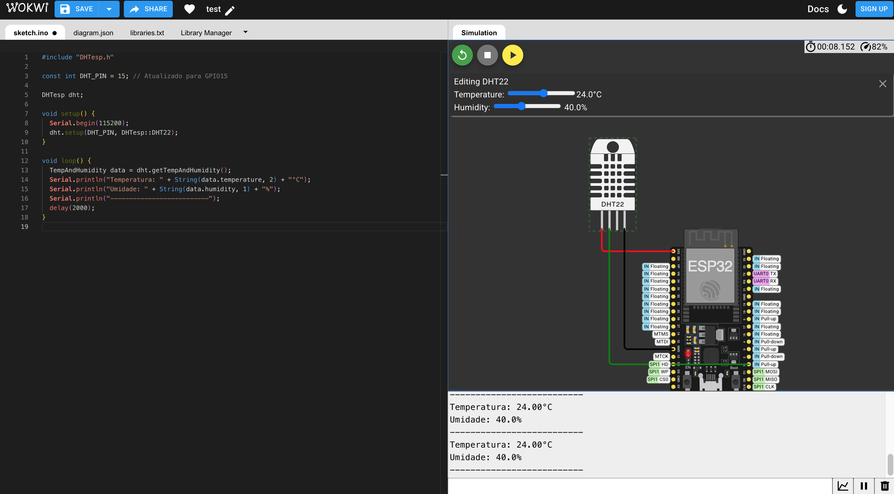
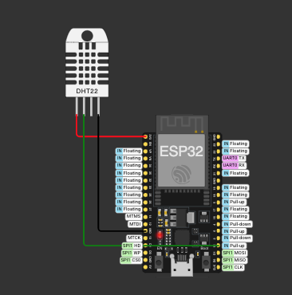

# esp32-dht22-simulacao

## 🏗️ Projeto de Coleta de Dados com ESP32 + DHT22

## 🔧 Descrição
Este projeto simula um sistema de coleta de dados ambientais utilizando um microcontrolador **ESP32** e um sensor **DHT22**. O objetivo é replicar uma situação real de chão de fábrica, onde sensores coletam dados como temperatura e umidade para monitoramento e análise.

## ⚙️ Componentes utilizados
- ESP32
- Sensor DHT22 (Temperatura e Umidade)

## 🔌 Esquemático do Circuito

## 🧠 Funcionamento
O sensor DHT22 coleta dados de temperatura e umidade, os quais são lidos pelo ESP32 e exibidos no Monitor Serial.

### 🎯 Prints do Monitor Serial

## 📈 Dados simulados
- Temperatura: 24°C
- Umidade: 40%

Os valores podem ser ajustados diretamente na interface da simulação no Wokwi.

## ✅ Justificativa da escolha do sensor
Para a simulação, optamos por utilizar o sensor **DHT22**, que realiza a medição de **temperatura e umidade relativa do ambiente**. Esse sensor foi escolhido por ser amplamente utilizado em ambientes industriais para monitoramento de condições ambientais, o que é essencial na detecção de riscos operacionais, variações que podem impactar máquinas, produtos ou processos e na antecipação de possíveis falhas.

Na indústria, o controle de temperatura e umidade é crucial para:
- Manter a estabilidade de máquinas sensíveis.
- Garantir a qualidade de insumos e processos.
- Atuar preventivamente na manutenção, evitando superaquecimento e ambientes com umidade excessiva que favorecem desgaste ou falhas.

Além disso, o DHT22 possui boa precisão, baixo custo e fácil integração com sistemas embarcados como o ESP32, tornando-o uma excelente escolha para simulações de projetos de IoT e Indústria 4.0.

## 🚀 Link do projeto no Wokwi
[🔗 Acessar simulação no Wokwi](https://wokwi.com/projects/433679549801602049)
